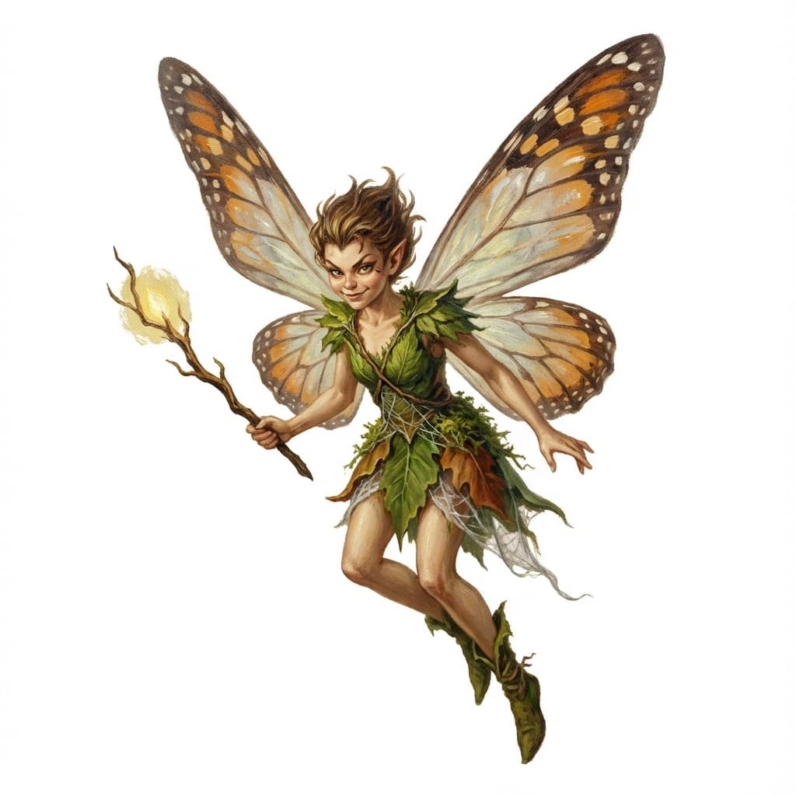
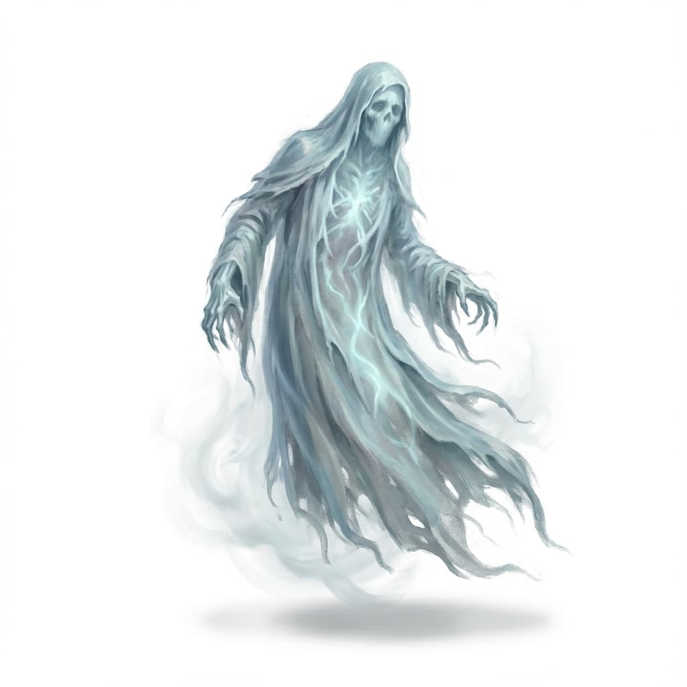

# Fantasy Creature Generation

* **Type:** Image Generation
* **Tested With:**
  * Nano Banana Pro/Gemini 3 Pro
* **Includes:**
  * Meta-prompting
  * Role Prompting
  * Tree of Thought
  * Chain-of-Thought

This prompt generates images of creatures in the oil painting on canvas style of old-school fantasy table top role playing games and classic movie posters. By default, it'll draw the described creature on a flat white background, but an optional scene can be included (wrapped in `[scene]…[/scene]` tags). Special attention is paid to creatures that stand (they get a little grass underneath their feet), swim (they get little bits of water surrounding them), and fly. When paired with a reasoning model that does image generation (like Nano Banana Pro), this can be successfully combined with "zero-shot" creature prompts (like "ankylosaurus") to get really excellent results.

## How it was made

This prompt started as a standard CRAFT (Context, Role, Action, Format, Tone) prompt, which wound up not getting me quite the results I wanted. Every once in a while it would return exactly what I was expecting, but it often would return something out-of-the-blue. I rewrote the prompt into this XML structure and then fed the prompt itself back into Gemini 3 Pro, starting a _meta-prompt_ loop, where I initially asked it to improve my prompt to make sure that the result _always_ matched my desired style. Once that was consistent, I continued down the meta-prompting route, checking the results with what I knew were corner cases, coming back when it failed, and asking it to update the prompt with the new constraints. At one point, it was doing everything I wanted _except_ consistently returning the image on a flat white background—when I asked about that, it identified a problem in the overall prompting logic and separated out the background requirements and style from the subject requirements and style. Meta-prompting works!

## Why it works

* By giving the prompt both a comprehensive role and core directive, the overall style of the generated image can be dialed in
* Giving it a specific set of steps to follow provides structure for reasoning models to follow. Including branching logic that includes different steps for different needs (like the scene option) constrains operations that should only happen some of the time.
* Including specific constraints across the board (overall constraints and specific in-step constraints) works to remove unwanted generation artifacts that were popping up. In particular, the negative constraints around sticker, die-cut border, border, and frame were required as they are specific unrequested additions that were being introduced into the images that didn't belong.
* Including a verification step helps to guide reasoning models to make sure that what was produced matches key critical requirements for the overall image.

## Sample images

Each sample includes the image and the zero-shot prompt included after the provided system prompt.

### Nano Banana Pro


`ankylosaurus`

This was one of my edge cases. Previously zero-shot prompting for an ankylosaurus left me with creatures that only roughly resembled one—the tail club and back armor spikes were almost always wrong. A focus on anatomical correctness in the prompt improved this for me.



`fairy`

This was a test of a flying creature to make sure it floated "in the void".



`ghost`

This was another one of my edge cases. They float, but just off the ground, so I wanted to test if they'd be treated as flyers or walkers. While less important for ghosts, it'd be more important for more fantastical creatures that float off the ground.


`hunter shark`

This was an attempt to see how it'd handle a slightly more abstract request, as well as see how it handles the "swimmer" directive. I particularly like the "speed lines" for the water to show aggressive motion. I think I'll call him Bruce.


`Orc ranger dressed in layered fur armor hunting with his panther companion`

This was another edge case—a test to see how it'd deal with multiple creatures together with a specific action being performed. Previously when I had asked for compositions like this it'd create a whole scene for me. With the adjustments, it's correctly only returning the primary characters and a small hint of land.


```md
A huge ancient black dragon shooting globs of acid from its mouth.
[scene] The dragon flies over a road in the middle of the day, attacking armored knights [/scene]
```

A final test to show how its branching rules work to show a scene.